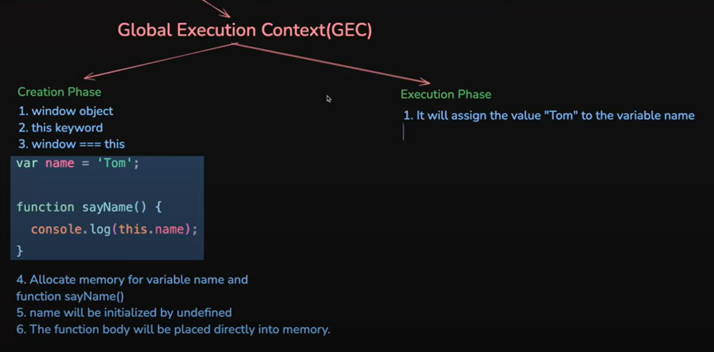
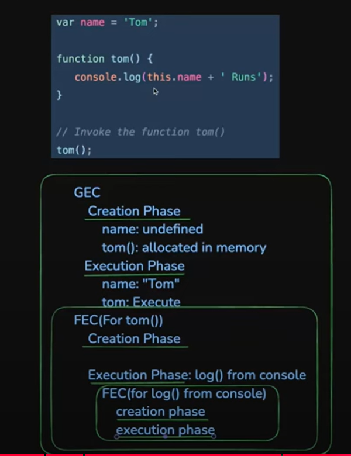
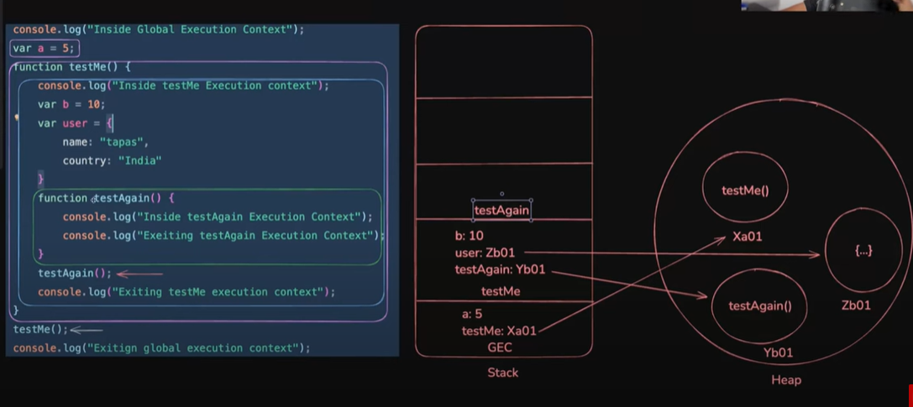

# Execution Context


## JavaScript Execution Flow (Step-by-Step)

| Step | Name                          | Description |
|------|-------------------------------|-------------|
| 1    | **Loading**                   | Browser downloads the JavaScript file. |
| 2    | **Parsing**                   | JS engine reads the code, checks syntax, and builds an Abstract Syntax Tree (AST). |
| 3    | **Compilation**              | AST is converted into bytecode or machine code using Just-In-Time (JIT) compilation. |
| 4    | **Global Execution Context Creation by Execution Context Manager** | Sets up the global environment: hoists variables/functions and sets `this` to the global object. |
| 5    | **Creation Phase**           | Memory is allocated: variables are initialized as `undefined`, functions are stored. |
| 6    | **Execution Phase**          | Code is executed line-by-line, values are assigned, and functions are invoked. |
| 7    | **Function Execution Context** | A new context is created for each function call and pushed onto the Call Stack. |
| 8    | **Call Stack Management**    | Tracks active function calls; pops contexts off the stack once functions complete. |
| 9    | **Event Loop & Callback Queue** | Handles asynchronous tasks like `setTimeout`, `fetch`, etc., after main thread is idle. |
| 10   | **Execution Complete**       | Code finishes executing or continues waiting for asynchronous events. |


## Execution Context
- Execution Context is a concept that describes the environment in which JavaScript code is evaluated and executed.

### 🔄 What Happens:
- JavaScript engine **scans the code**.
- It creates an **Execution Context**.
- **Memory is allocated** for variables and functions.
- The code is then **executed**.

---

## 🧩 Types of Execution Context

### 1. Global Execution Context (GEC)
- Created **once** when the script execution starts. 
- Represents the **global scope**.
- Only once context is created during runtime is called GEC.
- In browsers, it's the `window` object.(global in nodejs)

### 2. Function Execution Context (FEC)
- Created **every time a function is called**.
- Represents the **local scope** of that function.
- Multiple function contexts can be created during runtime.
- Similar to GEC and creates the following things
  - ### Creation phase (variable environment,memory component,memory creation phase)
  - Creation of argument object 
  - Creation of this object(this is keyword) (with reference of global object)
  - Memory allocation for variable (var,let,const) and functon in local scope
  - Assign the variable and function declaration with default value and function body
  - Setup the argument object with local scope
  - ### Execution phase (thread of execution,code component,code execution phase)
  - assignment of lates value to variabel and function call happen (creation of new context)

### 2. Eval Execution Context (rarely used)
- An Eval Execution Context is created when JavaScript code is executed dynamically using eval(), new Function(), or similar mechanisms. These allow you to run strings as code at runtime.
- Using eval() is considered bad practice (security and performance concerns).

---


## 🧩 Phase of Execution Context
- There are two phases of JavaScript execution context:

### 1. Creation Phase
- In this phase, JavaScript engine sets up the environment for the code by: creating the execution context, setting the this value, allocating memory for variables and functions,  creating the lexical environment, and setting up the scope chain.
- Create a global object (window in browser)(global in nodejs).
- this keyword creation with reference of the window object (this===window) -> true (have same reference object)
- memory allocation for variable and funciton
- Assign the variable declaration with default value and function body (fully hoisted with code)(full access before declaration)
- Creation of lexical environment
- Setting scope chain
#### note: Every variable is accessable if they have declarationo + initialization (with defualt value at creation phase or latest value at runtime).
- var have (D + I)  at creation phase so that we can access before variabel initalzation with latest value during runtime.
- but let/const only have (D) at CP but initialization at runtime so that before I not able to access and get erro.
```js
console.log(amu);  // undefined -> declaration and initialization (with default value:undegined) at creation phase, so that we can access before latest value intialization during runtime.
var amu="hey";     // latest value assign during code execution phase
console.log(amu);  // hey
```


```js
// console.log(amu);  // Uncaught ReferenceError: Cannot access 'amu' before initialization -> terminate the program
// # Declaration is happen during memory creation phase but initialization is not happen cause (value unavailable)(TDZ),
// # So that variable is not fully intialized so that we can't access  this variable and get aboe erro.
let amu="hey";        // latest value assign during code execution phase
console.log(amu);     // hey
```


```js
// Same error can't access before initialization
// console.log(amu);
const amu="hey";
console.log(amu);
```

```js
// # Execute becuase fully hoisted during memory creation phase
sayHi();  

function sayHi(){
    console.log("Hello world");
}
```


```js
// # In Arrow function case
sayHi();  // index.js:2 Uncaught TypeError: sayHi is not a function
// # cuase sayHi is variable and this hoisted with undefined vlaue
// # Note: When using arrow functions, you must declare them first, then use them.
var sayHi =()=>{
    console.log("Hello world");
}
```


---




---


### 1. Execution  Phase
- In this phase, JavaScript runs the code line by line, assigns actual values to variables, and executes any function calls.
- variable intialization with latest value 
- creation of function execution context on function call


## Hoisting

- JS Hoisting refers to the process whereby the interpreter appears to move the declaration of variables, functions, classes, or imports to the top of their scope, prior to execution of the code.
- In the creation phase, the interpreter scans the code.
- variable and function are hoisted
- var (with undefined) and function (with fully body code) hoisted during creation phase so that they accessible before initalization


```js
var temp="bro";
console.log(temp);  // bro

console.log(temp2); // undefined (due to hoisted with default value during creation phase)
var temp2="bro";
```

- let/const variable hoisted but JS store in different zone (not allow to acces ) this zone is call Temporal Dead Zone (TDZ).
- The TDZ refers to the period where a variable exists in a scope but cannot be accessed until it is initialized with latest value(during code execution)
- The TDZ in JavaScript is a valuable feature that encourages better coding practices and prevents common errors related to variable declaration of var (bugs in var)


```js
let temp="bro";     
console.log(temp);  // After accessible of initalization during code executio phase

console.log(temp2); // ReferenceError: Cannot access 'temp2' before initialization
let temp2="bro";
```


```js
const temp="bro";     
console.log(temp);  // After accessible of initalization during code executio phase

console.log(temp2); // ReferenceError: Cannot access 'temp2' before initialization
const temp2="bro";
```


## JavaScript Hoisting Summary Table

| Feature                             | `var`                        | `let`                             | `const`                           |
|-------------------------------------|------------------------------|-----------------------------------|-----------------------------------|
| **Scope**                           | Function / Global            | Block                             | Block                             |
| **Hoisted**                         | ✅ Yes                       | ✅ Yes                            | ✅ Yes                            |
| **Initialized during hoisting**     | ✅ Yes (`undefined`)         | ❌ No (in Temporal Dead Zone)     | ❌ No (in Temporal Dead Zone)     |
| **Accessible before initialization**| ✅ Yes                       | ❌ No (ReferenceError)            | ❌ No (ReferenceError)            |
| **Can be re-declared in same scope**| ✅ Yes                       | ❌ No                             | ❌ No                             |
| **Can be reassigned**               | ✅ Yes                       | ✅ Yes                            | ❌ No                             |
| **Must be initialized at declaration** | ❌ No                    | ❌ No                             | ✅ Yes                            |
| **Attached to global `this`**       | ✅ Yes (in global scope)     | ❌ No                             | ❌ No                             |

> 🔸 **Note:** Only `var` declared in the global scope becomes a property of the global object (`window` in browsers). `let` and `const` do **not** attach to `this` or the global object.


---


## CallStack (Executio stack)
- A mechanism which is used to keep track of the places of the multiple function calls is called callstack
- This mechanism used by the interpreter (like the JavaScript interpreter in a web browser) 
- Js is single-threaed language, so it only do one thing at a time ,The callstack helps manage the order of in which functions are called and executed.
- Follow the LIFO rule(last in firs out) 

### Work
- When funciton is called,then pushed onto the stack
- When this function is called onther function than this new function is pushed onto the stack untill the last(most recent) funtionc finished the execution
- If function execution complete then popped off the stack. and control goes where it form call.
- maximum stack can cause stack overflow issues (RangeError)


```js
// # overflow issues by recursion
let count=0;
function sayHi()
{
    count++;
    sayHi();
}
try{
    sayHi();
}
catch{
    console.log("Maximum stacks possible::>",count);
}
```

## How Eexcution context work with callstack and Heap
- callStack store primitive value and reference of heap memory
- Heap store non-primitive vlaue (object,array,funciont body)
- youTube link ::> https://www.youtube.com/@tapasadhikary
---

---


## Stack & Heap
- stack store primitive vlaue and give copy of the value (so that original value is not chnaged)


```js
let a=10;
let b="Hi";
let c=a;     // Give copy of the value of the a 
c=c+1;
console.log(a);    // 10
console.log(b);    // Hi
console.log(c);    // 11
console.log(a);    // 10 (chnaged in c not reflect in a cause only copy given not reference)
```

- stack memoery

| Variable | Value  |
|----------|--------|
| a        | 10     |
| b        | "Hi"   |
| c        | 11     |


- Heap store non-primitive value and give reference of the vlaue (so that chnages can reflect in other variable which have same reference)


```js
let a=10;
let b="Hi";
let c=[1,2];     // this array object created in heap and reference is stored in c (in callstack)
let d=c;          // reference value is copy so that c and d pointing to the same memory location in heap
d.push(3);
console.log(a);    // 10
console.log(b);    // Hi
console.log(c);    // <0x01> of [1,2,3]
console.log(d);    // <0x01> of [1,2,3]
```


#### 📦 Stack Frame

| Variable | Value   |
|----------|---------|
| a        | 10      |
| b        | "Hi"    |
| c        | <0x01>  |
| d        | <0x01>  |

### 📂 Heap References

| Reference | Value    |
|-----------|----------|
| <0x01>    | [1, 2, 3] |

```js
let a=10;
let b="Hi";
let c=[1,2];     // this array object created in heap and reference is stored in c (in callstack)
let d=c;         // reference value is copy so that c and d pointing to the same memory location in heap
d=[1,2,3];       // new object is created in heasp and passed <0x02> (different memory address) to d vaiable in callstack
// # So vaiable c,d pointing to the different memory locatin of the Heap
console.log(a);    // 10
console.log(b);    // Hi
console.log(c);    // <0x01> of [1,2]
console.log(d);    // <0x02> of [1,2,3]
```


```js
let a=10;
let b=10;
console.log(a==b);  // true ::> same value
console.log(a===b); // true ::> same data types


let c=[1,2];
let d=c;
console.log(c==d);  // true  ::> same value cause (same reference)
console.log(c===d); // true  ::> same value & same types


let e=[1,2];
let f=[1,2,3];
console.log(e==f);  // false ::> differ value  cause differ memory reference
console.log(e===f); // false ::> differ value but same types
```
