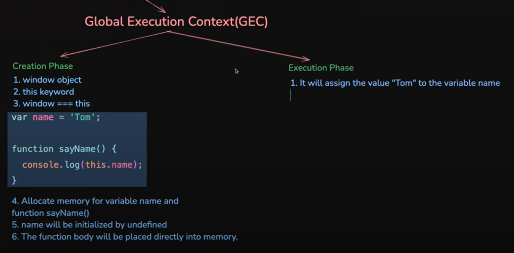
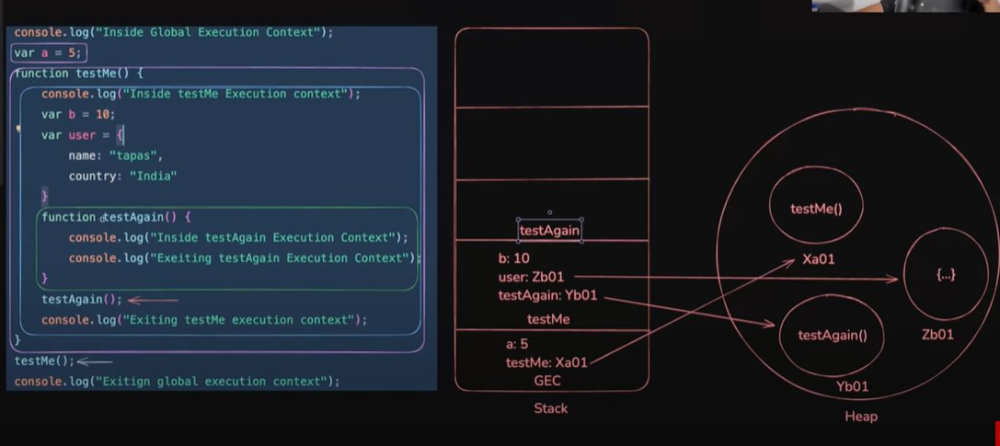

# Execution Context


## JavaScript Execution Flow (Step-by-Step)

| Step | Name                          | Description |
|------|-------------------------------|-------------|
| 1    | **Loading**                   | Browser downloads the JavaScript file. |
| 2    | **Parsing**                   | JS engine reads the code, checks syntax, and builds an Abstract Syntax Tree (AST). |
| 3    | **Compilation**              | AST is converted into bytecode or machine code using Just-In-Time (JIT) compilation. |
| 4    | **Global Execution Context Creation by Execution Context Manager** | Sets up the global environment: hoists variables/functions and sets `this` to the global object. |
| 5    | **Creation Phase**           | Memory is allocated: variables are initialized as `undefined`, functions are stored. |
| 6    | **Execution Phase**          | Code is executed line-by-line, values are assigned, and functions are invoked. |
| 7    | **Function Execution Context** | A new context is created for each function call and pushed onto the Call Stack. |
| 8    | **Call Stack Management**    | Tracks active function calls; pops contexts off the stack once functions complete. |
| 9    | **Event Loop & Callback Queue** | Handles asynchronous tasks like `setTimeout`, `fetch`, etc., after main thread is idle. |
| 10   | **Execution Complete**       | Code finishes executing or continues waiting for asynchronous events. |


## Execution Context
- Execution Context is a concept that describes the environment in which JavaScript code is evaluated and executed.

### 🔄 What Happens:
- JavaScript engine **scans the code**.
- It creates an **Execution Context**.
- **Memory is allocated** for variables and functions.
- The code is then **executed**.

---

## 🧩 Types of Execution Context

### 1. Global Execution Context (GEC)
- Created **once** when the script starts.
- Represents the **global scope**.
- In browsers, it's the `window` object.(global in nodejs)

### 2. Function Execution Context (FEC)
- Created **every time a function is called**.
- Represents the **local scope** of that function.
- Multiple function contexts can be created during runtime.

### 2. Eval Execution Context (rarely used)

---


## 🧩 Phase of Execution Context
- There are two phases of JavaScript execution context:

### 1. Creation Phase
- In this phase, JavaScript engine sets up the environment for the code by: creating the execution context, allocating memory for variables and functions, setting the this value, creating the lexical environment, and setting up the scope chain.
- window object creation
- this keyword creation with reference of the window object (this===window) -> true (have same reference object)
- memory allocation of the variabel with default value and function body (fully hoisted with code)(full access before declaration)
- creating the scope chain
- setup the lexical environment

#### note:
```js
console.log(amu);  // undefined -> declaration & defualt initialzation (with undefined) during memory allocation phase
var amu="hey";     // latest value assign during code execution phase
console.log(amu);  // hey
```


```js
// console.log(amu);  // Uncaught ReferenceError: Cannot access 'amu' before initialization -> terminate the program
// # Cause only declaration is happen during memory creation phase but initialization is not happen,
// # Which is happen during code executio phase and than accessible let and const variable
let amu="hey";        // latest value assign during code execution phase
console.log(amu);     // hey
```


```js
// Same error can't access before initialization
// console.log(amu);
const amu="hey";
console.log(amu);
```

```js
// # Execute becuase fully hoisted during memory creation phase
sayHi();  

function sayHi(){
    console.log("Hello world");
}
```


```js
// # In Arrow function case
sayHi();  // index.js:2 Uncaught TypeError: sayHi is not a function
// # cuase sayHi is variable and this hoisted with undefined vlaue
// # Note: When using arrow functions, you must declare them first, then use them.
var sayHi =()=>{
    console.log("Hello world");
}
```


---



---


### 1. Execution  Phase
- In this phase, JavaScript runs the code line by line, assigns actual values to variables, and executes any function calls.
- variable intialization with latest value 
- creation of function execution context on function call


## Hoisting

- JS Hoisting refers to the process whereby the interpreter appears to move the declaration of functions, variables, classes, or imports to the top of their scope, prior to execution of the code.
- In the creation phase, the interpreter scans the code.
- variable and function are hoisted
- var (with undefined) and function (with fully body code) hoisted during creation phase so that they accessible before initalization


```js
var temp="bro";
console.log(temp);  // bro

console.log(temp2); // undefined (due to hoisted with default value during creation phase)
var temp2="bro";
```

- let/const variable hoisted but JS store in different zone (not allow to acces ) this zone is call Temporal Dead Zone (TDZ).
- The TDZ refers to the period where a variable exists in a scope but cannot be accessed until it is initialized with latest value(during code executi)
- The TDZ in JavaScript is a valuable feature that encourages better coding practices and prevents common errors related to variable declaration (bugs in var)


```js
let temp="bro";     
console.log(temp);  // After accessible of initalization during code executio phase

console.log(temp2); // ReferenceError: Cannot access 'temp2' before initialization
let temp2="bro";
```


```js
const temp="bro";     
console.log(temp);  // After accessible of initalization during code executio phase

console.log(temp2); // ReferenceError: Cannot access 'temp2' before initialization
const temp2="bro";
```


## JavaScript Hoisting Summary Table

| Feature                      | `var`                   | `let` / `const`         | `function`                     |
|-----------------------------|--------------------------|--------------------------|--------------------------------|
| **Hoisted**                 | ✅ Yes                   | ✅ Yes                   | ✅ Yes                         |
| **Initialized during hoist**| ✅ As `undefined`        | ❌ No (due to Temporal Dead Zone (TDZ))                 | ✅ Yes (entire function body) |
| **Can be accessed before declaration?** | ⚠️ Yes (returns `undefined`) | ❌ No (ReferenceError,cause not access before intialization in code execution phase) | ✅ Yes (fully usable)         |
| **Reassignment allowed**    | ✅ Yes                   | ✅ Yes (❌ No const)                  | ✅ Yes                         |
| **Redeclaration in same scope** | ✅ Yes              | ❌ No                    | ✅ (function declaration)      |

---


## CallStack
- A mechanism which is used to keep track of the places of the multiple function calls is called callstack
- This mechanism used by the interpreter (like the JavaScript interpreter in a web browser) 
- Js is single-threaed language, so it only do one thing at a time ,The callstack helps manage the order of in which functions are called and executed.
- Follow the FIFO (first in firs out rule)

### Work
- When funciton is called,then pushed onto the stack
- When this function is called onther function than this new function is pushed onto the stack untill the last(most recent) funtionc finished the execution
- If function execution complete then popped off the stack. and control goes where it form call.
- maximum stack can cause stack overflow issues (RangeError)


```js
// # overflow issues by recursion
let count=0;
function sayHi()
{
    count++;
    sayHi();
}
try{
    sayHi();
}
catch{
    console.log("Maximum stacks possible::>",count);
}
```

## How Eexcution context work with callstack and Heap
- callStack store primitive value and reference of heap memory
- Heap store non-primitive vlaue (object,array,funciont body)
- youTube link ::> https://www.youtube.com/@tapasadhikary
---

---


## Heap
## Scope 
## Block