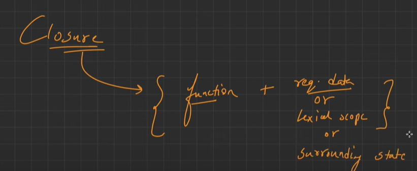
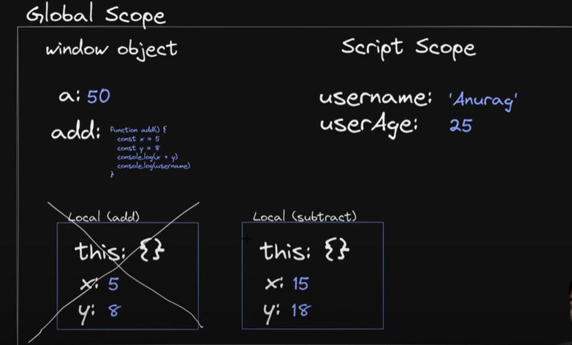

# Scope
- Scope means the area in your code where a variable or value can be seen or used. If something is outside the scope, you can’t use it from where you are.
- The scope is the current context of execution in which values and expressions are "visible" or can be referenced. If a variable or expression is not in the current scope, it will not be available for use. Scopes can also be layered in a hierarchy, so that child scopes have access to parent scopes, but not vice versa.
- Scope in JavaScript refers to the accessibility or visibility of variables and expressions. That means the space where an item, such as a variable or a function, is visible and accessible in your code.
- consider i room in which i access each things which is visibel but not inner rooms (cause don't khonw what inside untill door opening by inner room )
- outer room can't see untill window opend (return & exposed by inner funcion) inner room
- but inner room can see and used outer things (cause it is visible) (like meeting room in office)
- but outer room not see & used inner things


## Why is Scope important?
- ✅ Controls variable accessibility
- Scope determines where a variable can be accessed in your code (inside a function, block, or globally).
- ✅ Prevents naming conflicts
- Variables declared in different scopes can have the same name without interfering with each other.
- ✅ Improves code readability and maintainability
- Scoped variables make it easier to understand and debug code since their usage is limited to specific parts.
- ✅ Supports data encapsulation
- Scope helps hide internal logic and variables from the outside, improving modularity and security.
- ✅ Helps manage memory efficiently
- Variables are destroyed once they go out of scope, freeing up memory automatically.
- ✅ Enables closures and functional programming
- Scope allows inner functions to remember and access variables from their parent scope even after the parent has finished executing.
- ✅ Ensures predictable behavior of variables
- Understanding scope prevents bugs caused by unintended variable access or reassignment.


## Types of Scope

1. **Global Scope**
2. **Function Scope**
3. **Block Scope**
4. **Lexical Scope (Closures)**

### Global Scope
- Variable declared outside function & block is access from anywher in code


```js
let a=10;
console.log(a);
function say()
{
    console.log(a);
}
say();
{
    console.log(a);
}
if(true)
{
    console.log(a);
}
```

```js
// # Var is hoisted to function scope and global scope(if outside of funciton )(in any block except function block)
if(true){
     var amu1=10;     //hoisted to global
    console.log(amu1);
}
{
    var amu2=20;       //hoisted to global
   console.log(amu2);
}
for(i=0;i<=5;i++)
{
    var amu3=i;       //hoisted to global and each iteratio recreation of var is not happen only once (due to glocal scope)
}
function sayHi()
{
    var amu4=40;      // hoisted in that funciton local scope & destroyed after function execution done
    console.log(amu4);
}
console.log(amu1);  // 10
console.log(amu2);  // 20
console.log(amu3);  // 5
sayHi();
console.log(amu4);  // ReferenceError (var is hoisted in funciton scope and not access outside this scope )
```


- Hoisted to global scope means bind with global object (windwo) so that can access from any where in application (also from other script files)
- var/let/const and funciton can access from any-where in applicaiton (from any script files)
- let\const not access from outside the block scope(strictly follow th rule) and give better & safe programming pratice (unlike var)


### Function Scope
- Variables declared inside a function using var, let, or const are only accessible within that function.(not access outside scope)


```js
function say()
{
    let a=10;
    console.log(a); // 10
}
say();
console.log(a);   // ReferenceError: a is not defined
{
    console.log(a); // ReferenceError: a is not defined
}
if(true)
{
    console.log(a); // ReferenceError: a is not defined
}
```

### Block Scope
- Variables declared with let or const inside {} blocks (like if, for) are only accessible inside that block.
- var is declared inside {} block can access outside their scope cause hoisted to nearest funciton scope ( if inside function ),global scope ( if outside function )


```js
{
    var a=10;
    let b=20;
    const c=30;
    console.log(a);
    console.log(b);
    console.log(c);
}
console.log(a);  // 10
console.log(b);  // ReferenceError
console.log(c);  // ReferenceError
```

### Lexical Scope (static scope)
- Lexical Scope (also called Static Scope) means that a function’s scope is determined by where it is defined in the code, not where it is called.


```js
function outer() {
  let name = "NexGenDev";

  function inner() {
    console.log(name);  // ✅ Accesses outer function's variable
  }

  inner();
}
outer();

```


- An inner function has access to the variables of its outer function, even after the outer function has finished executing.


```js
function outer() {
  let x = 5;
  function inner() {
    console.log(x); // ✅ has access
  }
  return inner;
}

const func = outer();
func(); // prints 5
```


- Lexical scope means that a function has access to variables from the scope in which it was defined, not where it is executed. This concept is what powers closures in JavaScript.


### Closure 
- A closure is a function bundled with its lexical environment — it can remember variables from where it was created, not just where it’s called.
- The process of binding the required data (bind reference not copy) with function is called clouser
- inner function closes over outer funciton variables ---> format a closure
- YouTube link ::> https://www.youtube.com/watch?v=ThJOl1gqIjs



```js
function outerFunction()
{
    let name="developer";
    function innerFunction()
    {
        console.log(name);
    }
    innerFunction();
}

outerFunction();    // normal execution 
innerFunction();    // ReferenceError: innerFunction is not defined
```


```js
function outerFunction()
{
    let name="developer";
    return function innerFunction()
    {
        console.log(name);
    }
    // # inside innerFunciton ,it's form a clouser with the vaiable  which is part of the oueterFunciton lexical scope
    // # innerFunciton bind with the variable of the outerFunction and create clouser
}

let value=outerFunction();    // return reference of innerFunciont()
// # After returning of outerFuntion their execution context will be completley removed from callStack 
value(); // developer print
// # innerFuncitn is accessible causee in heap is now referenced is by value (garbeage not consider as dead object)
```


```js
// # One way
function x()
{
    let a=5;
    function y()
    {
        console.log(a);
    }
    return y;
}

let z=x();
z();       // 5

// # Second Way
function x()
{
    let a=5;
    return function y()
    {
        console.log(a);
    }
}

let z=x();
z();       // 5
```


- 
## Function
- “In JavaScript, function code is stored in the heap as an object. When the function is called, the engine creates an execution context in the stack, which references the function code in the heap. This keeps memory efficient and allows reuse of the function definition.”
- This execution context includes the below things:
  - `this`
  - Parameters
  - Local variables
  - A reference to the outer lexical environment (for closures)
  - A pointer to the function code (which is used to manages local state of the callstack)

- Each function object created in different memory location in heap also nested function

```js
function fun1(){}
function fun2(){}
let a=fun1();  // return undefined cause in js each function by default return undefined
let b=fun2();
console.log(a);  // undefined
console.log(b);  // undefined
console.log(a==b); // true 
console.log(a===b); // true
```


```js
function fun1(){}
function fun2(){}
let a=fun1;
let b=fun2;
console.log(a);  // referernce to fun1
console.log(b);  // referernce to fun2
console.log(a==b); // false (differ reference) 
console.log(a===b); // false (same function object but differ reference value)
```


- Also Nested funciton get different memory location in heap
- In JavaScript, the outer function gets memory during the parsing phase. The inner function is not created or stored in memory until the outer function is actually called. When that happens, the inner function is created and forms a closure by capturing the outer function's variables via lexical scope.
- Closure is formed during the execution phase, when an inner function is created inside an outer function and retains access to the outer function’s variables. This happens at runtime, not during memory allocation.
```js
function outer()
{
    let name="Hellow"
    return function inner()   // It created in heap if called outer() otherwise only outer() get moemory in Heap during memory creation phase
    {
        console.log(name);
    }
}
let a=outer;
let b=outer();   // inner() function object is created with closure in heap and return their reference
// # closure is linking betweeen child funciton object in heap
console.log(a);  // referernce of outer
console.log(b);  // referernce to inner
console.log(a==b); // false (differ reference) 
console.log(a===b); // false (same function object but differ reference value)
```

- Closure is a link between the inner (child) function and the outer function’s memory stored in heap.
- Closure is a connection made between inner function and outer function's data, so the inner function can use that data later.
---
## Global and Local scope execution
- youTube link ::> https://youtu.be/7QhMQRRBpZ0?si=kLwvp3ol4a02DKYF
```js
const userName="Anurag";
let userAge=25;
var a=50;

function add(){
    const x=5;
    const y=8;
    console.log(x+y);
    console.log(userName);
}

function subtract(){
    const x=5;
    const y=8;
    console.log(x-y);
    console.log(userName);
}
add();
subtract();

```



---


## Lexical and Block Scope
- youTube link ::> https://youtu.be/dvNqTN_nokg?si=pAg5b4deOq5KBAGi
## 🔍 Scope Chain:
